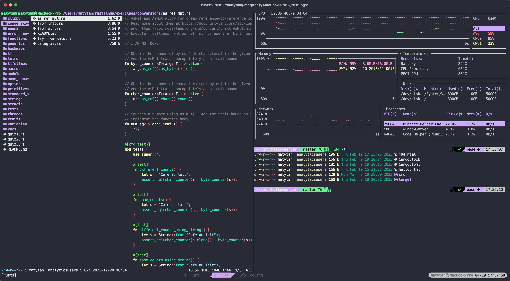

# tmux_config

## 会话、窗口与窗格的概念

[tmux 常用命令与快捷键 - 简书](tmux%20常用命令与快捷键%20-%20简书.md)
Tmux 中的主要概念分为三个：

- Session - Session 是 Tmux 中最主要的概念了，默认开启 Tmux 的时候，就会自动新建一个会话，在这个会话中，也会给你开启一个默认的 Window（也即窗口）。Tmux 中可以拥有多个会话，多个会话之间可以来回无缝切换。
- Window - 相比 session，Windows 是稍微小一点的单位。一个 session 中，可以开启多个 window。这些 window 同属于一个 Session，并由其管理。
- Panel - Panel 是比 Window 更小的界面元素。前面我们也提到了 Tmux 中可以对 window 进行任意分割，由 window 分割出来的单位就叫做 panel 了。在同一个 window 中，用户可以控制光标在分割出的 panel 中随意移动，用以选定当前作为激活状态的 panel。

如果看了这些概念还不太明白，也许下面这个图可以清晰的表明它们之间的关系：

[](https://xiaozhou.net/pics/tmux/1.svg)

他们的从属关系为：`Session -> Window -> Panel`

## [](#安装与配置 "安装与配置")安装与配置

Tmux 的安装也非常方便，通常 Ubuntu 下安装，使用:

```
sudo apt-get install tmux
```

在 mac OS 中，推荐使用 brew 来安装：

```
brew install tmux
```

## [](#Tmux简单配置 "Tmux简单配置")Tmux 简单配置

Tmux 在安装完成之后，可以立即启动，不过这还只算一个 “裸奔” 的 Tmux，因为很多配置项都是默认值，需要我们根据自己的喜好进行一些设置。从零开始创建一个 Tmux 是比较费神的，建议去网上寻找其他大神的配置文件来修改，这样比较快捷一些。这里提供一个[我经常使用的 Tmux 配置文件](https://github.com/matyle/tmux_config)，可以作为模板，直接下载后按照自己的喜好来更改。

需要注意的是，tmux 的配置文件本身是一个隐藏文件，也就是以 `.` 号开头的文件，叫做 `.tmux.conf` 。我们需要把这个文件放在当前用户的默认主目录下，也即 `~/.tmux.conf` ，tmux 启动后，会自动读取和加载里面的配置项。

配置文件就算这么搞定了，如果你是第一次接触 Tmux，建议不用太纠结如何弄清楚配置文件里面的每一项是什么意思，在后续的使用中，你可能会不断去修改和调整，自然而然也就熟悉了。接下来，我们要见识一下 Tmux 强大的各种快捷键功能。

## Tmux 使用效果



## [](#常用快捷键 "常用快捷键")常用快捷键

初次使用 Tmux 需要明白的是，Tmux 的各种快捷键功能，是需要一个`<prefix>` 组合键作为前缀的。也就是说，需要先按下 `<prefix>` 组合键，才能激活快捷键功能，然后再按对应各种功能的快捷键，才会生效。之所以这样设计，估计也是为了把快捷键的输入跟用户正常输入区分开来。

初次使用 Tmux，我们要知道的是，Tmux 为我们默认预备的 `<prefix>` 组合键，是 `C-b` (即 Ctrl+b)。当然，根据我们自己的习惯，如果觉得 `C-b` 按起来不方便，可以通过修改配置文件的方式，自定义自己喜欢的 `<prefix>` 组合键。比如我就觉得 `C-b`距离有点远，于是，我的 `<prefix>` 是这么定义的：

```
set -g prefix C-j
```

这里简单列举一下 Tmux 的部分快捷键操作，有些快捷键估计跟 Tmux 默认提供的不太一样，因为我根据自己的喜好进行了一些调整。

### [](#窗口-Window-操作 "窗口(Window)操作")窗口 (Window) 操作

```
<prefix> c  创建新窗口
<prefix> w  列出所有窗口
<prefix> n  后一个窗口
<prefix> p  前一个窗口
<prefix> f  查找窗口
<prefix> ,  重命名当前窗口
<prefix> &  关闭当前窗口
```

### [](#窗格-Panel-操作 "窗格(Panel)操作")窗格 (Panel) 操作

```
<prefix> |  垂直分割
<prefix> -  水平分割
<prefix> o  交换窗格
<prefix> x  关闭窗格
<prefix> <space> 切换布局
<prefix> q 显示每个窗格是第几个，当数字出现的时候按数字几就选中第几个窗格
<prefix> { 与上一个窗格交换位置
<prefix> } 与下一个窗格交换位置
<prefix> u 切换窗格最大化
<prefix> n 切换窗格最小化
<prefix> 0-9 切换到指定编号的窗口
```

### [](#窗格-Panel-选择 "窗格(Panel)选择")窗格 (Panel) 选择

```
<prefix> h 选择左边的窗格
<prefix> j 选择下面的窗格
<prefix> k 选择上面的窗格
<prefix> l 选择右边的窗格
```


### [](#窗格-Panel-尺寸调整 "窗格(Panel)尺寸调整")窗格 (Panel) 尺寸调整

```
<prefix> H 当前窗格向左扩大3格
<prefix> J 当前窗格向下扩大3格
<prefix> K 当前窗格向上扩大3格
<prefix> L 当前窗格向右扩大3格
```


### [](#会话-Session-相关 "会话(Session)相关")会话 (Session) 相关

```
<prefix> :new<回车>  启动新会话
<prefix> s           列出所有会话
<prefix> $           重命名当前会话
```

这里只是列出了部分 Tmux 常用快捷键，初学 Tmux，千万别被这么多的快捷键给吓住，随着使用 Tmux 时间的不断增加，这些快捷键最终会变为肌肉的条件反射，所谓的 “无剑胜有剑”，嘿嘿。

## 总结

Tmux 真是终端下的利器，在 macOS 下，配合 iTerm2 和 Vim，能轻松的打造出高效的开发环境。在服务端运行 Tmux，也能为你日常运维工作带来许多便利。所以，将 Tmux 大法谨记心中，他日必能为君带来极大的便利和效率。
